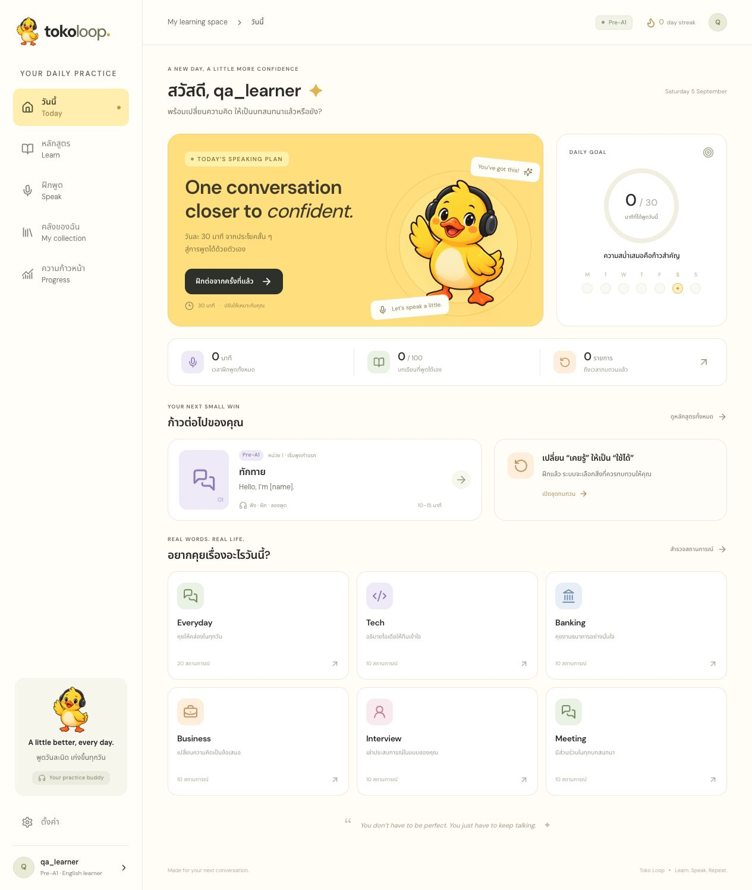
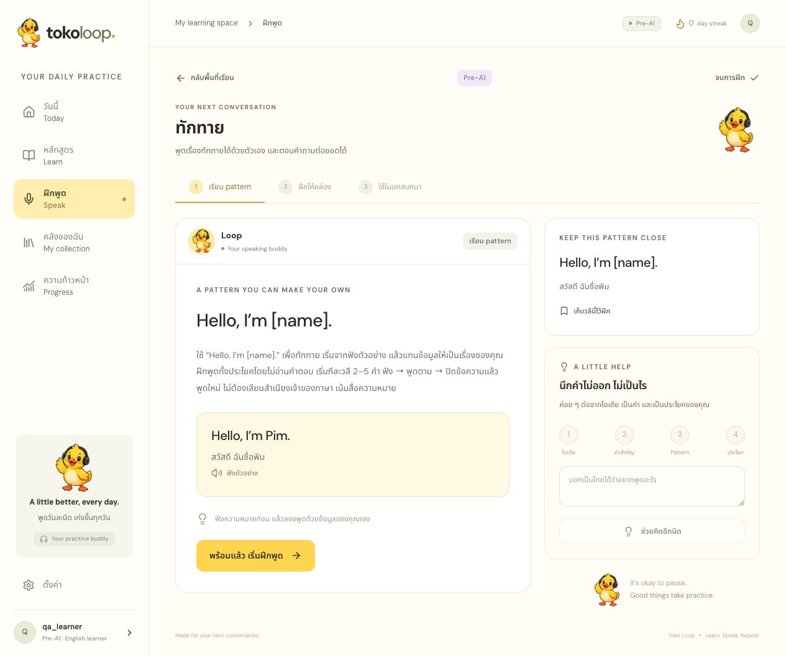
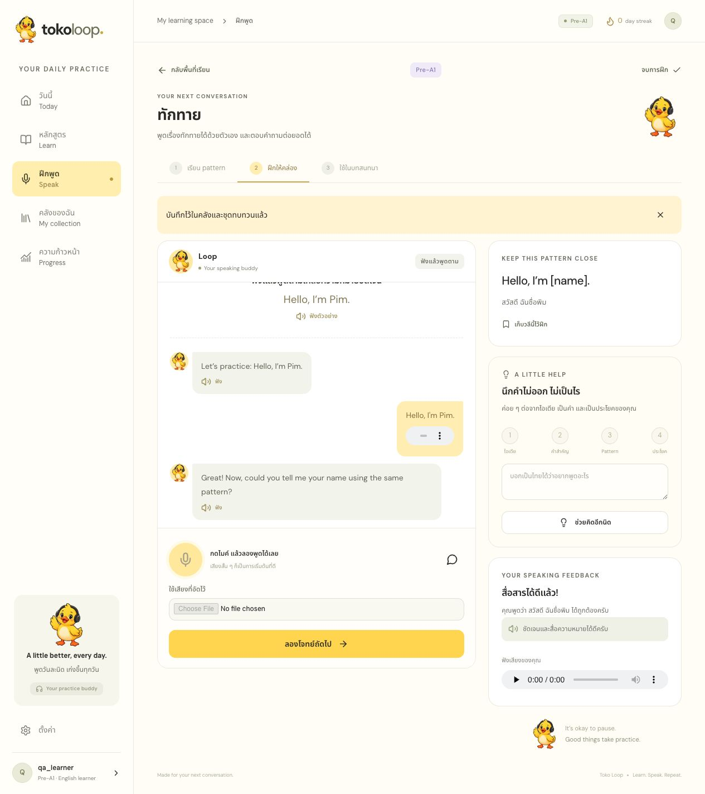
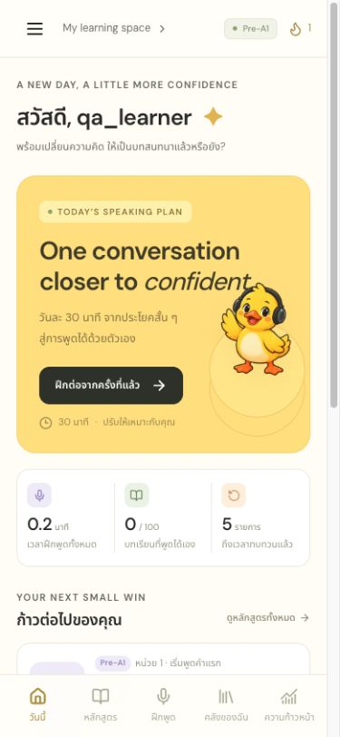
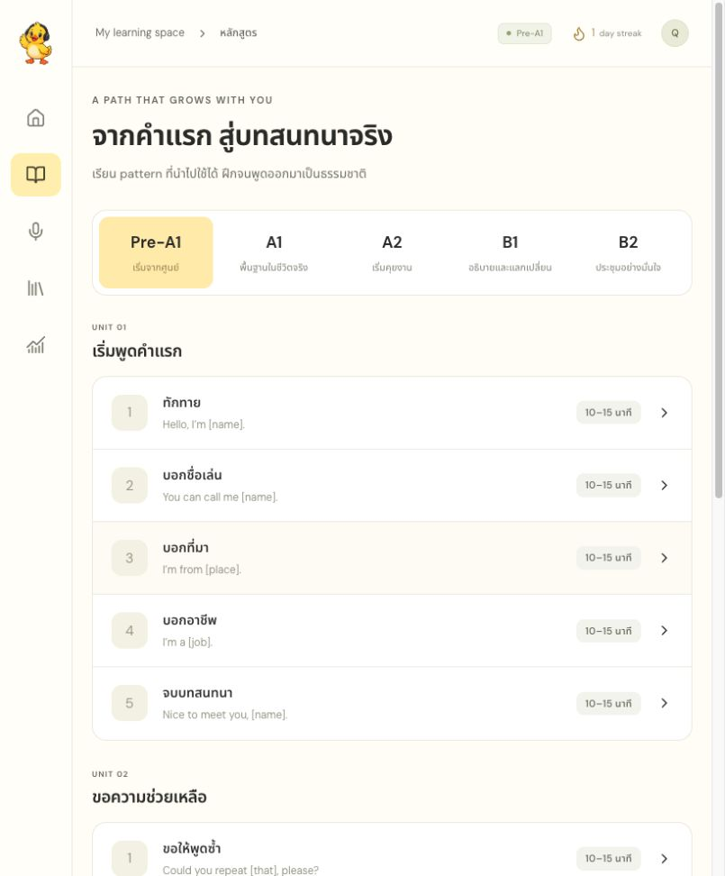

# Toko Loop

เว็บฝึกพูดภาษาอังกฤษสำหรับผู้เรียนไทย จากเริ่มต้นไปสู่ชีวิตประจำวันและการประชุม Tech / Banking / Business / Interview / Meeting

**Production:** https://ai-tutor-sooty-two.vercel.app  
**Backend:** https://toko-api.tarcloud.win/ai-tutor/api/v2

## ใช้งาน

สมัครด้วย username, password และ invitation ใช้ครั้งเดียวจาก admin (หมดอายุ 7 วัน) → เลือกเริ่มจากศูนย์หรือ placement → เปิดบทเรียน → ฟัง pattern → ฝึกเสียง 4 แบบ → รับ feedback / retry → สนทนาในบริบทใหม่ → ทบทวนและดู progress

มี 100 บท (5 ระดับ × 20) และ 70 ฉาก (50 ฉากงาน + 20 Everyday) พร้อมคลังศัพท์ 200 รายการตามบท คำใบ้ idea → keyword → pattern → sentence, custom scenario ที่แก้ก่อนเล่นได้, review scheduler, Live audio, ประวัติเสียง, เป้าหมาย/งบและ admin invitations การพิมพ์ไม่เพิ่ม speaking mastery

ระดับใช้จัดความยากภายในแอป ไม่ใช่การรับรอง CEFR หรือรับประกันความคล่องจากจำนวนบทเรียน

## พัฒนาและ deploy

```sh
npm ci
cp .env.example .env.local
npm run dev
npm run verify
```

ตั้ง `NEXT_PUBLIC_BACKEND_BASE_URL` เป็น URL รวม namespace เช่น `https://toko-api.tarcloud.win/ai-tutor/api/v2` ใน Vercel Production (และ Preview ถ้าต้องการ) ค่า URL เป็นข้อมูลสาธารณะ ห้ามใส่ Gemini key ใน frontend ตัว browser เรียก `/api` ผ่าน Next.js BFF ซึ่งเก็บ session cookie แบบ HttpOnly เพื่อรองรับ Safari และ backend คนละ domain

push branch `main` ใช้ Git integration ของ Vercel; ทางเลือก `scripts/deploy.sh` ใช้ project IDs/token จาก environment ไม่มี auto commit/push ใน script Backend repo แยกเป็น `../backend` และใช้ `deploy_local.sh` พร้อม readiness/rollback

`npm run generate:api` สร้าง TypeScript types และ snapshot จาก `../backend/contracts/openapi.json` การ build ปกติไม่ต้องมี backend repo อยู่ใน Vercel

## ผลทดสอบ 5 กันยายน 2026

- Frontend: typecheck, 6 tests และ production build ผ่าน
- Backend: Go tests/vet และ integration tests ผ่าน; API/Gemini happy flow 18/18
- AI rubric evaluation: 9/9 (valid alternative, grammar/style separation, off-topic, injection, unclear audio); ชุดนี้ยังไม่ใช่ benchmark สำเนียงไทยจริง
- Live: PCM input → input/output transcript + audio, origin validation, one-use ticket, reconnect และ stop แล้ว usage หยุดเพิ่ม ผ่าน
- Happy flow ผ่าน login, curriculum, audio upload → feedback → retry, review/progress/reload, library และสร้าง/แก้/เล่น custom scenario
- Responsive browser viewport ผ่าน 390×844 และ 820×1180; cached audio เล่นผ่าน BFF จริง
- รอบ QA พบ TTS timeout, sidebar บนจอเตี้ย, accessible names และจำนวน scenarios; แก้ timeout/retry/cost estimate, เพิ่ม bounded worker 2 งาน, เลื่อน sidebar ได้, เพิ่ม aria-label และแสดงจำนวนจริงแล้ว

ขั้นตอนและผลดิบ: [UI QA](docs/qa-local.md), backend `reports/qa-api.json`, `reports/live-smoke.json`, `reports/gemini-evaluation.json`

## ภาพจาก happy flow

### Desktop: วันนี้


### บทเรียนและ feedback



### iPhone / iPad viewport



## ขอบเขตที่ต้องตรวจบนอุปกรณ์จริง

ยังไม่ได้รับรอง mic permission, Bluetooth, Safari autoplay, lock screen และ interruption บน iPhone/iPad จริง ภาพข้างต้นเป็น responsive viewport บน browser ทดสอบ เสียง QA เป็น synthetic fixture ไม่ใช่หลักฐานความแม่นยำ pronunciation สำหรับผู้เรียนไทย หลักสูตรยังควรปรับจากผลการฝึกจริง โดยเฉพาะพื้นฐานตัวเลข/ราคาและ cumulative assessment

PWA เก็บเฉพาะ assets ที่จำเป็น ไม่รองรับบทเรียน AI offline; ไม่มี YouTube import, ข่าวสด หรือ push notifications ตามขอบเขตที่ตกลง
